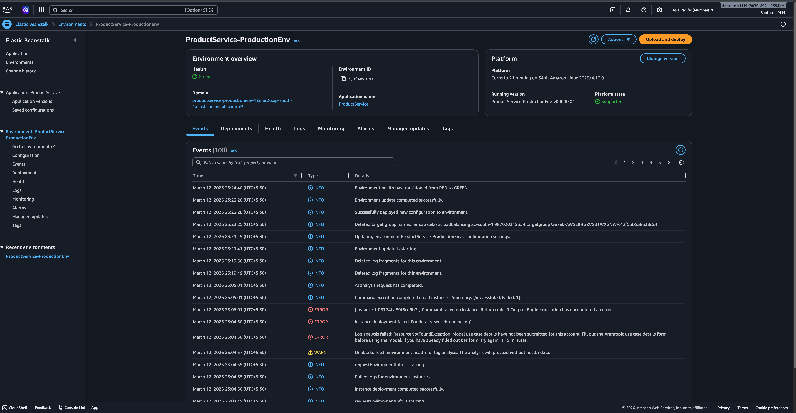
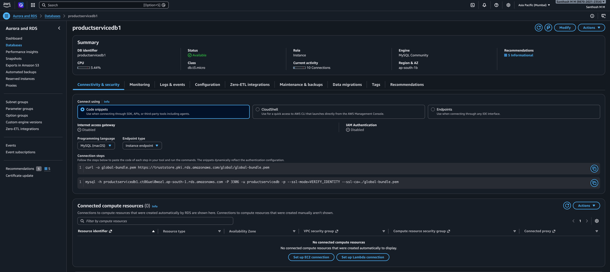
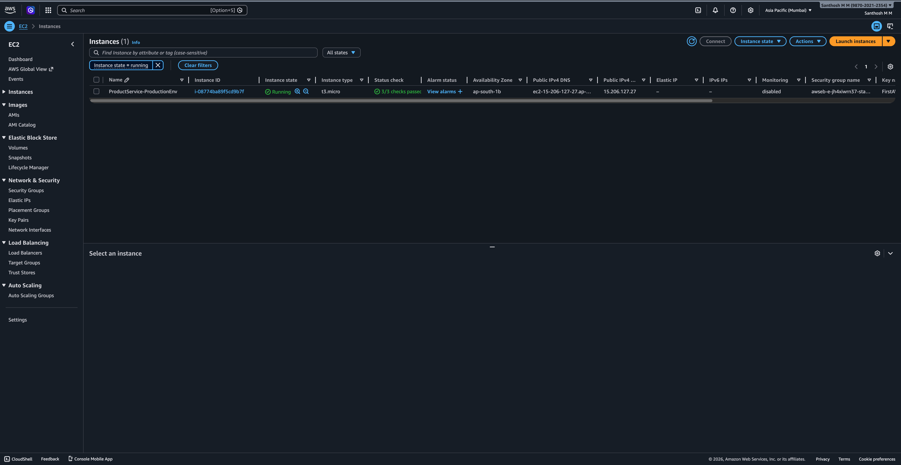
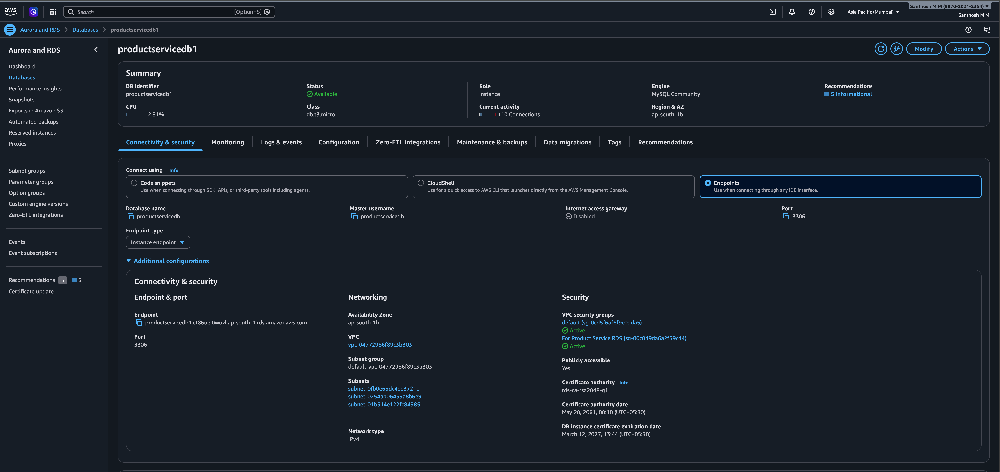
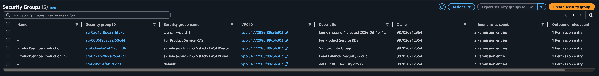
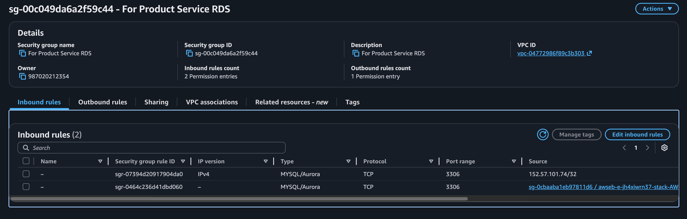

## Product Service

A Spring Boot 3 RESTful API for managing products and categories, backed by MySQL and Flyway migrations. It demonstrates layered architecture with controllers, services, repositories, DTOs, and global exception handling.

### Tech stack

- **Language**: Java 21
- **Framework**: Spring Boot 3.3.2
- **Build tool**: Maven
- **Persistence**: Spring Data JPA / Hibernate
- **Database**: MySQL
- **Migrations**: Flyway (`src/main/resources/db/migration`)
- **HTTP client**: `RestTemplate` (for FakeStore integration)
- **Testing**: JUnit 5, Spring Boot Test, MockMvc

### Project structure (high level)

- **`src/main/java/com/example/productservice`**
  - **`Productservice`**: Spring Boot entry point (`@SpringBootApplication`).
  - **`controllers`**: REST controllers (e.g. `ProductController`) exposing `/products` endpoints.
  - **`services`**:
    - `ProductService`: service interface.
    - `ProductServiceDBImpl`: database-backed implementation (used by the controller via `@Qualifier("dbProductService")`).
    - `ProductServiceFakestoreImpl`: alternative implementation that integrates with `https://fakestoreapi.com` using `RestTemplate`.
  - **`models`**: JPA entities (`BaseModel`, `Product`, `Category`, `Subcategory`).
  - **`repositories`**: Spring Data JPA repositories (`ProductRepository`, `CategoryRepository`) with derived queries and custom JPQL/native queries.
  - **`dtos`**: Request/response DTOs for products, FakeStore integration, and error responses.
  - **`configs`**: Application configuration (`ApplicationConfiguration` defines the `RestTemplate` bean).
  - **`advices`**: Global exception handling (`ExceptionAdvices`).
- **`src/main/resources`**
  - **`application.properties`**: application name, datasource, JPA, and Flyway settings.
  - **`db/migration`**: Flyway SQL migrations creating and evolving the schema.
- **`src/test/java/com/example/productservice/controllers`**
  - `ProductControllerTest`: controller unit test with mocked `ProductService`.
  - `ProductControllerMvcTest`: MockMvc-based tests for the `/products` endpoints.

### Database & migrations

The service uses MySQL as the primary data store and Flyway for schema management.

- **Migrations**: Located under `src/main/resources/db/migration`, for example:
  - `V1__.sql`: creates `product`, `category`, `subcategory`, and junction tables with relationships.
  - `V2__add_countofproducts.sql`: adds a `count_of_products` column to the `category` table.
- On application startup, Flyway runs pending migrations against the configured database.

#### Required database setup

1. **Create a MySQL database** (name must match the one in `application.properties` or your override):
   - Example from the current config: `productservice27july`.
2. **Create a database user** with permissions on that database:
   - Username is configured in `application.properties` (e.g. `dbuserproductservice24july`).
3. **Configure credentials**:
   - Either update `spring.datasource.username` and `spring.datasource.password` in `src/main/resources/application.properties`,
   - Or set the corresponding environment variables (e.g. `SPRING_DATASOURCE_URL`, `SPRING_DATASOURCE_USERNAME`, `SPRING_DATASOURCE_PASSWORD`).

Once the datasource is configured, Flyway will create/update the schema the first time the app starts.

### Running the application locally

#### Prerequisites

- Java 21 installed.
- MySQL running and reachable with the configured URL and credentials.
- Maven wrapper (`mvnw`) is included in the project (or a system Maven installation).

#### Steps

1. **Clone the repository**:

   ```bash
   git clone <this-repo-url>
   cd productservice
   ```

2. **Verify / adjust datasource configuration** in `src/main/resources/application.properties` or via environment variables as described above.

3. **Build and run** using the Maven wrapper:

   ```bash
   ./mvnw clean package
   ./mvnw spring-boot:run
   ```

   The application will start on the default Spring Boot port `8080` (unless overridden).

### API overview

All endpoints are rooted at **`/products`** and handled by `ProductController`.

- **GET `/products`**
  - **Description**: Returns all products from the database.
  - **Response**: A DTO wrapping a list of product representations (see `GetAllProductsResponseDto` / `GetProductDto`).

- **GET `/products/{id}`**
  - **Description**: Fetch a single product by ID using the `dbProductService` implementation.
  - **Success**: Returns a `GetProductResponseDTO` containing the product.
  - **Error handling**:
    - `id < 0` results in a `ProductNotFoundException` wrapped in a runtime exception.
    - `id == 0` throws `RuntimeException("Something went wrong")`.
    - `ExceptionAdvices` converts `RuntimeException` into a JSON `ErrorResponseDto` with `status` and `message` fields.

- **POST `/products`**
  - **Description**: Creates a new product.
  - **Request body**: `CreateProductRequestDto` (includes product fields such as `title`, `description`, `price`, `imageUrl`, and category info).
  - **Behavior**:
    - `ProductServiceDBImpl` ensures the category exists (creating it if necessary) and saves the product.
  - **Response**: `CreateProductResponseDto` with the persisted product data.

- **PATCH `/products/{id}`**
  - **Description**: Partially updates an existing product (title, description, price, category).
  - **Request body**: `CreateProductDto` (fields are optional; only non-null fields are applied).
  - **Behavior**:
    - `ProductServiceDBImpl.partialUpdateProduct` looks up the product, updates provided fields, and saves it.
  - **Response**: `PatchProductResponseDto` with the updated product.

- **PUT `/products/{id}`** and **DELETE `/products/{id}`**
  - Currently stubbed out in `ProductController` and return an empty `Product` instance.
  - Intended for full replace and delete operations; their implementations can be added following the patterns already used in the service layer.

### Service implementations

- **`ProductServiceDBImpl` (`@Service("dbProductService")`)**
  - Uses `ProductRepository` and `CategoryRepository` to interact with the MySQL database.
  - Handles:
    - Creating products and categories (with cascade and relationship management).
    - Fetching all products.
    - Partial updates of product fields.
    - Fetching a product by ID with proper `ProductNotFoundException` handling.

- **`ProductServiceFakestoreImpl` (`@Service("fakeStoreProductService")`)**
  - Integrates with `https://fakestoreapi.com/products` via `RestTemplate`.
  - Demonstrates:
    - Mapping between internal `Product` model and FakeStore request/response DTOs.
    - Creating and fetching products from an external API.
  - Currently not wired into `ProductController`, but can be injected via `@Qualifier("fakeStoreProductService")` if you want to switch to the FakeStore-backed implementation.

### Global error handling

- `ExceptionAdvices` uses `@ControllerAdvice` to handle exceptions across controllers:
  - **`RuntimeException`**: mapped to an `ErrorResponseDto` containing `status` and `message`.
  - **`Exception`** (fallback): returns a simple `"something went wrong"` message.

This centralizes error responses and keeps controller methods focused on happy-path logic.

### Testing

You can run the tests with:

```bash
./mvnw test
```

Key tests:

- **`ProductControllerTest`**
  - Uses `@SpringBootTest` with a mocked `dbProductService`.
  - Verifies that `getProductById`:
    - Returns the expected DTO when a valid ID is passed.
    - Throws a `RuntimeException` with message `"Something went wrong"` when called with `id = 0L`.

- **`ProductControllerMvcTest`**
  - Uses `@WebMvcTest(ProductController.class)` and `MockMvc` to test:
    - `GET /products` returns the expected DTO structure.
    - `POST /products` creates a product via the mocked `ProductService` and returns the expected JSON.


## Deployment

The Product Service application was deployed on AWS using Elastic Beanstalk and connected to a MySQL database hosted on AWS RDS. This deployment demonstrates how a Spring Boot application can be packaged, deployed, and made accessible through a cloud environment.

---

### Infrastructure Used

The following AWS services were used during deployment:

- **AWS Elastic Beanstalk** – Application deployment and environment management
- **AWS EC2** – Compute instance running the application
- **AWS RDS (MySQL)** – Managed relational database service
- **Elastic Load Balancer** – Routes incoming traffic to the application instance
- **Nginx Reverse Proxy** – Handles HTTP requests and forwards them to the Spring Boot application

---

### Deployment Architecture

The deployed architecture follows a standard backend cloud setup.
Internet   
↓  
Elastic Load Balancer    
↓  
EC2 Instance (Elastic Beanstalk Environment)    
↓  
Spring Boot Application (Port 5000)  
↓  
AWS RDS MySQL Database (Port 3306)  


---

### Build Process

The Spring Boot application was packaged into an executable JAR using Maven.
mvn clean package -DskipTests


This command generated the deployable artifact located at:
target/productservice-0.0.1-SNAPSHOT.jar


This JAR file was uploaded to the Elastic Beanstalk environment for deployment.

---

### Deployment Steps

1. Created an **Elastic Beanstalk Application** in AWS.
2. Selected **Java Corretto platform** for running the Spring Boot application.
3. Uploaded the generated **JAR file** to Elastic Beanstalk.
4. Elastic Beanstalk automatically provisioned the required infrastructure including:
  - EC2 instance
  - Load balancer
  - Nginx configuration
5. Configured environment variables and database connection properties.
6. Connected the application to **AWS RDS MySQL** database.
7. Configured a health check endpoint to monitor application status.

---

### Health Check Configuration

A health check endpoint was created in the application:
/health

Elastic Beanstalk periodically checks this endpoint to verify that the application is running correctly.  
If the endpoint returns **HTTP 200**, the environment status becomes **Healthy (GREEN)**.

---

### Security Configuration

Security groups were configured to control network access between services.

- The **EC2 instance** accepts HTTP requests from the internet.
- The **RDS database** allows MySQL access only from the EC2 instance security group.
- Direct public access to the database is disabled.

This ensures that the database remains secure and accessible only through the application server.

---

## AWS Security Groups Used in Deployment

Security groups were configured to control network access between the application server and the database.

The following security groups were used:

- **Elastic Beanstalk EC2 Security Group** – Allows HTTP traffic to the application server.
- **Elastic Load Balancer Security Group** – Handles incoming internet requests.
- **RDS Security Group** – Allows MySQL connections from the EC2 instance only.

This configuration ensures that the database is not publicly accessible and can only be accessed by the application server.

### Deployment Proof

The following screenshots demonstrate successful deployment.

**1. Elastic Beanstalk Environment Status**



---

**2. AWS RDS Database Instance**



---
**3. EC2 Instance Running**




---

**4. Security Groups Overview**



---

**5 Custom Security Group for RDS (Port 3306)**



---


### Notes

To avoid unnecessary AWS charges, the Elastic Beanstalk environment and related resources were terminated after testing the deployment. Screenshots included above serve as proof of successful deployment.


### Notes & next steps

- **PUT/DELETE implementations**: The `replaceProduct` and `deleteProductById` methods in `ProductController` are currently placeholders and can be implemented using `ProductRepository` operations.
- **Configurable service backend**: For experimentation, you can switch from `dbProductService` to `fakeStoreProductService` in the controller constructor or via Spring configuration/profiles.
- **Validation & security**: Input validation, authentication, and authorization are not yet implemented and can be added depending on your requirements.

